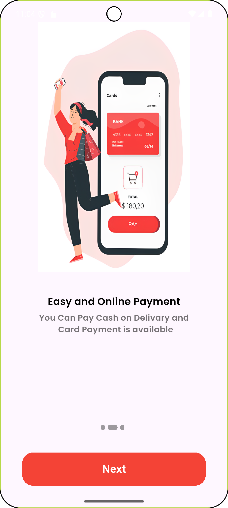
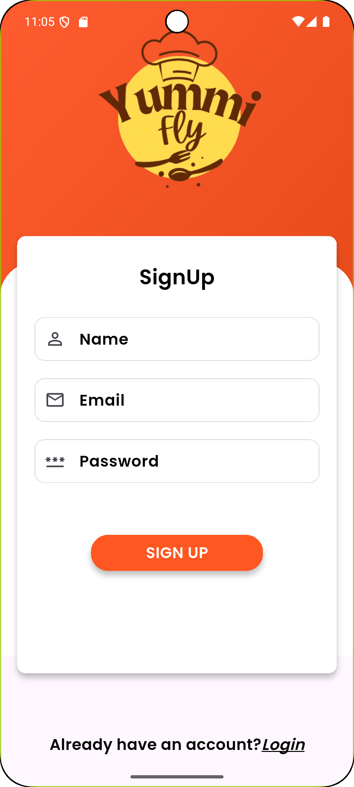
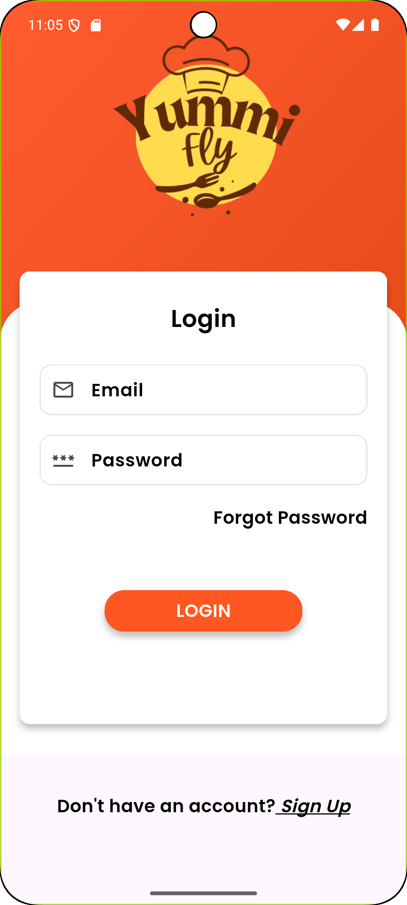
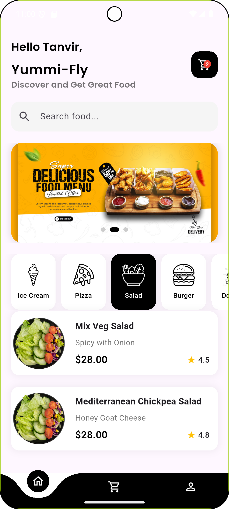
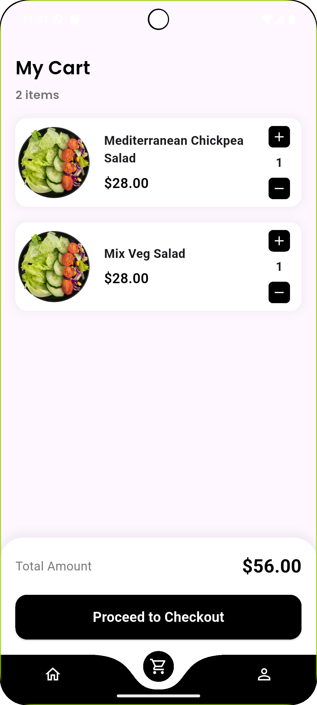
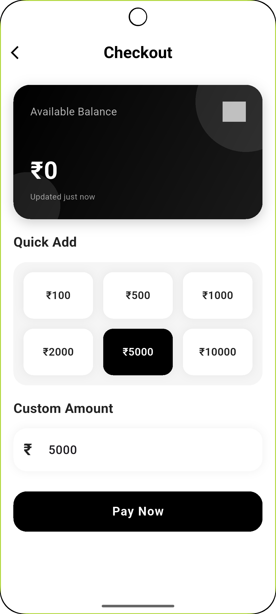
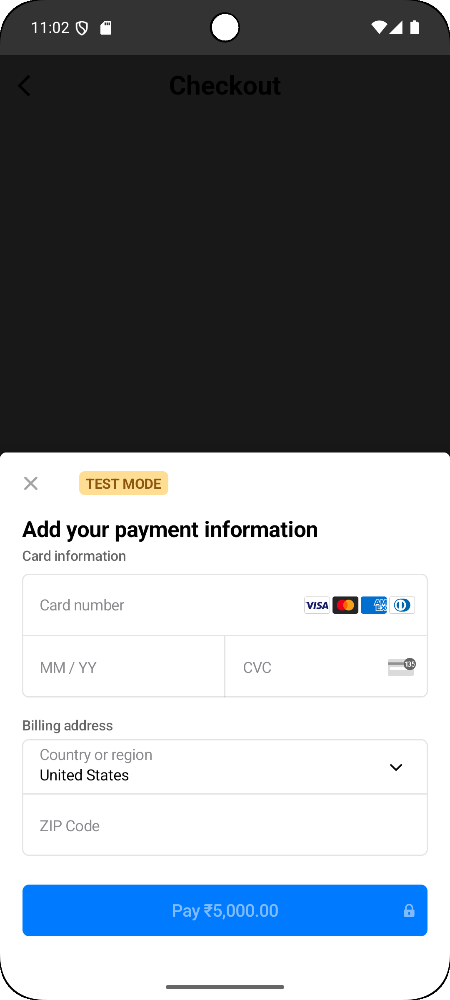
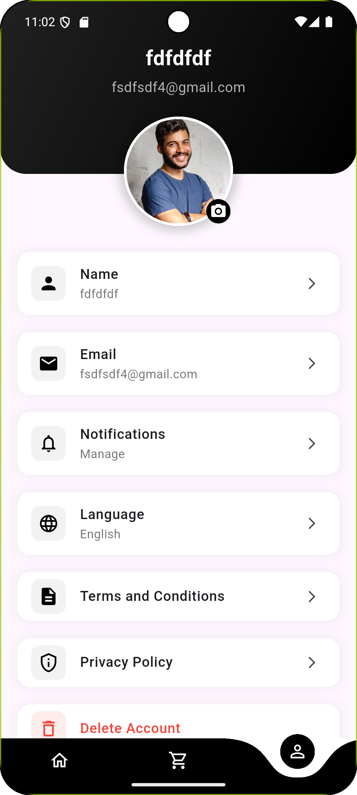

# 🍔 Yummi Fly - Flutter Food Delivery App

**Yummi Fly** is a cross-platform food delivery application developed using **Flutter** with **Firebase Authentication** and **Stripe Payments** integration. It provides a seamless user experience for customers to browse food, place orders, and manage their accounts, and also includes an admin panel for backend tasks.

---

## 📸 App Screenshots

<p align="center">
  
  
  
  
  
  
  
  
  
  
</p>

---

## 🧱 Project Structure

```
lib/
├── AccountAuthCreation/
│   ├── login.dart
│   ├── signup.dart
│   ├── onboard.dart
│   └── forgetpass.dart
│
├── admin/
│   ├── components/
│   │   └── add_food_items.dart
│   ├── admin_home.dart
│   └── admin_login.dart
│
├── pages/
│   ├── bottomnav.dart
│   ├── cart.dart
│   ├── details.dart
│   ├── home.dart
│   ├── order.dart
│   ├── profile.dart
│   └── wallet.dart
│
├── service/
│   ├── database.dart
│   └── shared_pref.dart
│
├── widget/
│   └── AppConstant.dart
│
└── main.dart
```

---

## 🚀 Features

- 🔐 **Firebase Authentication**
  - Email & password login/signup
- 🍽️ Browse food items
- 🛒 Add to Cart, Order Summary
- 💳 **Stripe Payment Gateway**
- 👤 Profile & wallet section
- 🛠 Admin panel: Add/view food items
- 🎨 Intro slides with onboarding UI

---

## ⚙️ Setup & Run

1. **Clone the repo**

```bash
git clone https://github.com/tanvir-chy-ahmed/yummi-fly-food-delivary-app.git
cd yummi_fly_app
```

2. **Install dependencies**

```bash
flutter pub get
```

3. **Configure Firebase**
  - Add `google-services.json` (Android)
  - Add `GoogleService-Info.plist` (iOS)
  - Enable **Email/Password Auth** in Firebase Console

4. **Set Stripe Key**

Inside `main.dart`:

```dart
Stripe.publishableKey = "0xxxxxx";
```

5. **Run the app**

```bash
flutter run
```

---

## 📌 To-Do

- ✅ Firebase Auth
- ✅ Stripe Payments
- 🔄 Firebase Firestore integration (orders, menu)
- 🌐 Google Sign-In
- 🔔 Push notifications
- 📍 Google Maps delivery tracking (future)

---

## 👨‍💻 Developer

**Tanvir Ahmed Chowdhury**  
📧 [tanvirchy269@gmail.com]  
🔗 [GitHub](https://github.com/tanvir-chy-ahmed) | [LinkedIn](https://www.linkedin.com/in/tanvir-ahmed-chy-126191367/)

---

## ⭐ Support

If you like this project, don’t forget to ⭐ it on GitHub and share!

